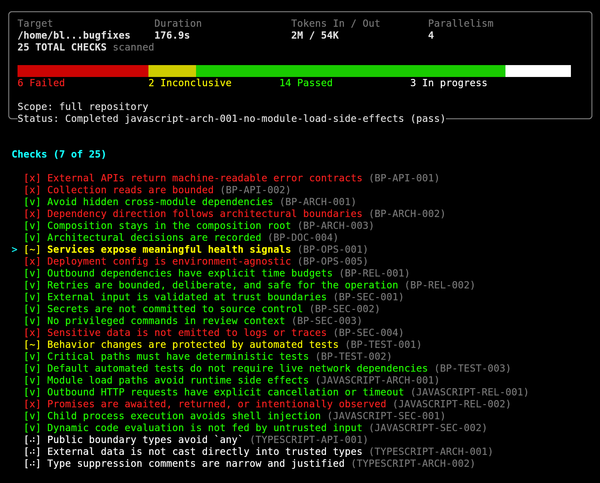

# OpenShrike

Turn engineering best practices into tests your team can run and enforce.


OpenShrike is a security-first, self-hosted implementation of a new kind of
test: best-practice tests.

It is built for the gap between linters and unit tests. Linters catch style and
syntax. Unit tests check behavior. OpenShrike checks whether a change follows
the engineering practices your team already relies on in production:
architectural boundaries, test discipline, input validation, timeouts, secrets
handling, observability, API safety, and similar review standards.

Those standards ship as versioned Markdown checks and policies in
[best_practices/](best_practices/). `shrike init` seeds the selected policy
into repo-local Markdown files under `.openshrike/checks/`, so the checks that
actually run live in the project, can be reviewed in code review, and can be
edited or extended by maintainers. OpenShrike executes those project-local
checks with OpenCode and produces findings with evidence, rationale, and
remediation.



## Why OpenShrike

- Turn tribal knowledge, review comments, and design standards into concrete,
  repeatable checks.
- Tailor policies to the project instead of forcing a one-size-fits-all rule
  set.
- Focus on high-signal engineering risks, not formatting noise.
- Run the same review locally and in CI.
- Keep execution self-hosted with `native` and `docker` runtimes.

## Install

Prerequisite: Node.js 22+.

Install the latest GitHub release:

```bash
curl -fsSL https://raw.githubusercontent.com/Network-Perspective/OpenShrike/main/install | bash
```

On Windows PowerShell:

```powershell
irm https://raw.githubusercontent.com/Network-Perspective/OpenShrike/main/install.ps1 | iex
```


## Simple workflow

Assume `shrike` is on your `PATH`. If you are running directly from this
repository, use `./shrike` instead.

```bash
shrike init
shrike scan
```

- `shrike init` is interactive. It detects the project, helps establish
  AI provider access, lets you choose defaults, and writes
  `.openshrike/project.json`, `.openshrike/opencode.json`, and seeds
  `.openshrike/checks/`.
- `shrike scan` uses those saved defaults automatically and reads the
  Markdown checks from `.openshrike/checks/`. By default it scans
  uncommitted changes in the current repository.
- Re-run `shrike init` when you want to seed checks from a different policy
  or change saved model, runtime mode, or parallelism defaults.

## Install From Source

Prerequisite: Node.js 22+.

```bash
npm install
npm run build
scripts/install-local.sh --source ./shrike --link
```

If `~/.local/bin` is not on your `PATH`, add it in your shell profile.
`shrike init` expects an interactive terminal.

## What Gets Tested

OpenShrike policies are bundles of checks for things like:

- architecture and dependency boundaries,
- behavior-covering and deterministic tests,
- boundary validation and secret hygiene,
- time budgets, retries, and cancellation,
- deployability, health signals, and observability,
- API and data-shaping safety.

The bundled library is documented in
[best_practices/README.md](best_practices/README.md). The goal is not to
duplicate linters. The goal is to enforce the practices that actually keep
systems safe, maintainable, observable, and reliable.

## Command Reference

### `shrike init`

Interactive setup for the local `.openshrike/` directory.

```bash
shrike init [--force]
```

- `--force`: prefer replacing generated setup when initialization already
  exists.

### `shrike scan`

After `shrike init`, a plain `shrike scan` uses saved defaults from
`.openshrike/project.json` and executes the Markdown checks in
`.openshrike/checks/`. Without saved defaults, `scan` requires exactly one of
`--check` or `--policy`.

```bash
shrike scan \
  [--check <CHECK_ID> | --policy <POLICY_ID>] \
  [--repo <PATH>] \
  [--output json|markdown] \
  [--agent <NAME>] \
  [--model <PROVIDER/MODEL>] \
  [--emit-bundle <PATH>] \
  [--scan-scope uncommitted|commit|branch|pr|full] \
  [--scan-target <TARGET>] \
  [--mock-opencode] \
  [--config <PATH>] \
  [--log <PATH>] \
  [--runtime native|docker] \
  [--image <REF>] \
  [--artifacts-dir <PATH>] \
  [--parallelism <N|auto>] \
  [--no-ui]
```

Common behavior:

- `--repo .`, `--output markdown`, `--scan-scope uncommitted`, `--runtime native`,
  and `--parallelism auto` are the default values when not overridden by saved
  project settings.
- `commit` requires `--scan-target <COMMIT_OR_RANGE>`.
- `branch` requires `--scan-target <BASE_BRANCH>` and compares
  `<BASE_BRANCH>...HEAD`.
- `pr` uses `--scan-target <DIFF_SPEC>` or defaults to `origin/main...HEAD`.
- `full` scans the whole repository.
- `--runtime docker` runs an ephemeral worker container.
- If Docker is selected without `--image`, OpenShrike uses
  `openshrike-runtime:dev` and builds it from
  `docker/openshrike-runtime.Dockerfile` when needed.
- `--artifacts-dir` controls where runtime artifacts such as `report.json` and
  logs are written.
- In Docker mode, OpenShrike forwards only env vars explicitly referenced by
  the selected OpenCode config (`provider.*.env`, `${VAR}`, or `{env:VAR}`).
  Native/Docker parity depends on declaring required env vars in
  `.openshrike/opencode.json`.
- `--mock-opencode` exercises the scan path without live OpenCode calls.
- `--no-ui` disables the live terminal dashboard on stderr.

## Examples

Use saved defaults:

```bash
shrike scan
```

Add or customize checks by editing Markdown files in `.openshrike/checks/`.

Run a specific policy without saved defaults:

```bash
shrike scan --policy typescript-baseline --repo .
```

Run a single check against a full repository:

```bash
shrike scan \
  --check csharp-rel-001-cancellation-tokens \
  --repo ../OpenShrike.TestsCsharp \
  --scan-scope full
```

Run a PR-style scan in Docker:

```bash
shrike scan \
  --policy csharp-baseline \
  --repo . \
  --scan-scope pr \
  --scan-target origin/main...HEAD \
  --runtime docker \
  --output json
```

## Output And Exit Codes

- `--output markdown` is the default and emits human-readable reports and error messages.
- `--output json` emits machine-readable reports and error envelopes.
- Exit code `0`: no failing checks.
- Exit code `2`: one or more failing checks.
- Exit code `1`: command or runtime error.

## Development

```bash
npm run dev -- scan --policy csharp-baseline --repo .
npm run build
npm run typecheck
npm test
```

The `./shrike` launcher uses `tsx src/cli.ts` when available and falls back to
`dist/cli.js`.

## Publish And Install

Create a local framework bundle:

```bash
scripts/publish.sh
```

Install from the published framework bundle:

```bash
scripts/install-local.sh --source .artifacts/publish/framework
```

Tagging a release with `v*` also triggers `.github/workflows/release-bundles.yml`
to build GitHub release archives for the supported Linux, macOS, and Windows
targets.

Prepare a release locally so only `git push` remains:

```bash
scripts/create-release.sh
```

That script bumps the patch version, stages all current changes, creates a
commit named `chore(release): vX.Y.Z`, and creates an annotated `vX.Y.Z` tag.
Use `scripts/create-release.sh minor`, `major`, or an explicit version to
override the default patch bump.

## Documentation Map

- [Vision and scope](docs/requirements/01-project-vision.md)
- [Feature scope and phases](docs/requirements/02-feature-scope.md)
- [Security model](docs/requirements/03-security-model.md)
- [Agent runtime and isolation](docs/requirements/04-agent-runtime.md)
- [Best practices library](docs/requirements/05-best-practices-library.md)
- [Observability and feedback loop](docs/requirements/06-observability.md)
- [Workflows and integrations](docs/requirements/07-workflows-and-integrations.md)
- [MVP implementation notes](docs/implementation/01-mvp-csharp-rel-001-implementation.md)
- [Fixture and branch workflow](docs/implementation/02-testscsharp-fixture-and-branches.md)
- [Phase 2 runtime and parallel plan](docs/implementation/03-phase-2-docker-runtime-and-multi-agent-plan.md)
- [Install and release distribution](docs/implementation/05-install-and-release-distribution.md)
