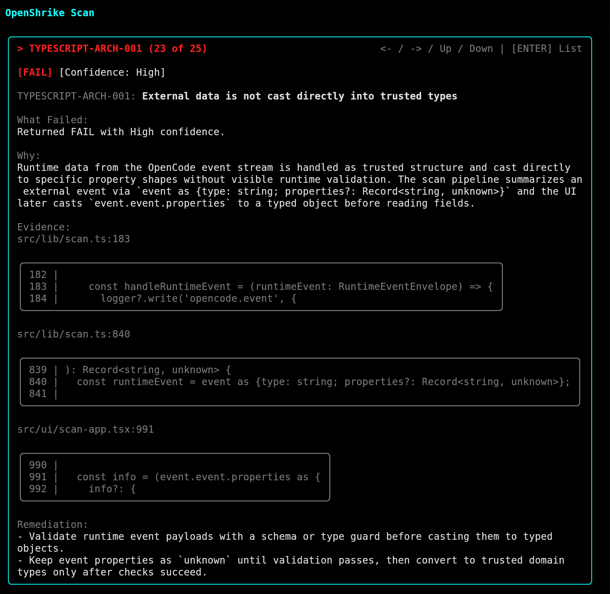

# OpenShrike

Security-first, self-hosted agentic code review for engineering best practices.


OpenShrike evaluates code and development artifacts against a versioned policy
library, using OpenCode as the execution runtime. It is designed for teams
using agentic workflows that need review signal beyond traditional linting.

Screenshots




## Project value

- Policy-as-data: checks and policies live as markdown in `best_practices/`,
  versioned with your codebase.
- Security-first runtime: read-only review sessions, explicit runtime config,
  and optional Docker isolation.
- Agent-ready output: JSON and Markdown findings with evidence, rationale, and
  remediation.
- Local and CI parity: same `shrike scan` command surface across fast local and
  hardened execution paths.

## Typical use cases

- Pre-PR self-review on uncommitted changes.
- PR/branch scanning in CI with report artifacts.
- Targeted verification for one high-risk check.
- Security-conscious review workflows using `--runtime docker`.

## Current implementation status

- Active implementation is TypeScript/Node in `src/`.
- Legacy C# implementation is archived in `archive/legacy-csharp/`.
- `scan` supports runtime backends `native` and `docker`.
- Parallel check workers are available via `--parallelism <N|auto>`.
- The Ink terminal UI streams worker progress and runtime events (disable with
  `--no-ui`).

## Quick start

Prerequisite: Node.js 22+.

```bash
npm install
npm run build
./shrike init --force
./shrike scan --policy typescript-baseline --repo .
```

## Runtime config (`shrike init`)

`./shrike init` writes these files to `.openshrike/`:

- `opencode.json`: OpenCode runtime config.
- `required-env.txt`: one required environment variable name per line.
- `runtime.env.example`: starter env-file template.
- `README.md`: local notes for generated runtime files.

Default required variables:

```text
AZURE_OPENAI_API_KEY
OPENSHRIKE_AZURE_OPENAI_BASE_URL
```

Keep secrets out of git and provide them at runtime (for example, container env
vars or `--env-file`).

## Scan usage

`scan` requires exactly one of `--check` or `--policy`.

```bash
./shrike scan \
  (--check <CHECK_ID> | --policy <POLICY_ID>) \
  --repo <PATH> \
  [--scan-scope uncommitted|commit|branch|pr|full] \
  [--scan-target <TARGET>] \
  [--runtime native|docker] \
  [--parallelism <N|auto>] \
  [--output json|markdown] \
  [--config <PATH>] \
  [--log <PATH>] \
  [--artifacts-dir <PATH>] \
  [--image <REF>] \
  [--emit-bundle <PATH>] \
  [--agent <NAME>] \
  [--model <provider/model>] \
  [--mock-opencode] \
  [--no-ui]
```

Scope behavior:

- `uncommitted` (default): changed tracked/untracked files in the working tree.
- `commit`: requires `--scan-target <COMMIT_OR_RANGE>`.
- `branch`: requires `--scan-target <BASE_BRANCH>` and compares
  `<BASE_BRANCH>...HEAD`.
- `pr`: uses `--scan-target <DIFF_SPEC>` or defaults to `origin/main...HEAD`.
- `full`: scans the entire repository.

Runtime behavior:

- `--runtime native` is the default fast local loop.
- `--runtime docker` runs an ephemeral worker container.
- If Docker mode is used without `--image`, OpenShrike uses
  `openshrike-runtime:dev` and builds it from
  `docker/openshrike-runtime.Dockerfile` when missing.
- `--artifacts-dir` controls where Docker worker artifacts are written (for
  example `report.json` and scan logs).

Parallelism:

- `--parallelism 1` is the default.
- `--parallelism auto` picks a safe concurrency level from available CPU and
  check count.

## Workflow examples

Fast local loop:

```bash
./shrike scan --policy typescript-baseline --repo . --runtime native --parallelism auto
```

PR/CI parity in Docker:

```bash
./shrike scan \
  --policy csharp-baseline \
  --repo . \
  --scan-scope pr \
  --scan-target origin/main...HEAD \
  --runtime docker \
  --parallelism auto \
  --artifacts-dir artifacts/shrike \
  --output json
```

Targeted single-check verification:

```bash
./shrike scan \
  --check csharp-rel-001-cancellation-tokens \
  --repo ../OpenShrike.TestsCsharp \
  --scan-scope full \
  --runtime docker
```

UI/report smoke test without OpenCode calls:

```bash
./shrike scan \
  --policy csharp-baseline \
  --repo . \
  --scan-scope full \
  --mock-opencode \
  --no-ui
```

## Output and exit codes

- `--output json` (default) emits machine-readable report data.
- `--output markdown` emits a human-readable report.
- Reports include an `execution` block with runtime and parallelism metadata.
- Exit code `0`: no failing checks.
- Exit code `2`: one or more failing checks.
- Exit code `1`: command/runtime error.

## Development

```bash
npm run dev -- scan --policy csharp-baseline --repo .
npm run build
npm run typecheck
npm test
```

The `./shrike` launcher uses `tsx src/cli.ts` when available, and falls back to
`dist/cli.js`.

## Publish and install

Create a framework bundle:

```bash
scripts/publish.sh
```

Install from source with a symlink:

```bash
scripts/install-local.sh --source ./shrike --link
```

Install from the published framework bundle:

```bash
scripts/install-local.sh --source .artifacts/publish/framework
```

## Documentation map

- [Vision and scope](docs/requirements/01-project-vision.md)
- [Feature scope and phases](docs/requirements/02-feature-scope.md)
- [Security model](docs/requirements/03-security-model.md)
- [Agent runtime and isolation](docs/requirements/04-agent-runtime.md)
- [Best practices library](docs/requirements/05-best-practices-library.md)
- [Observability and feedback loop](docs/requirements/06-observability.md)
- [Workflows and integrations](docs/requirements/07-workflows-and-integrations.md)
- [MVP implementation notes](docs/implementation/01-mvp-csharp-rel-001-implementation.md)
- [Fixture and branch workflow](docs/implementation/02-testscsharp-fixture-and-branches.md)
- [Phase 2 runtime and parallel plan](docs/implementation/03-phase-2-docker-runtime-and-multi-agent-plan.md)
