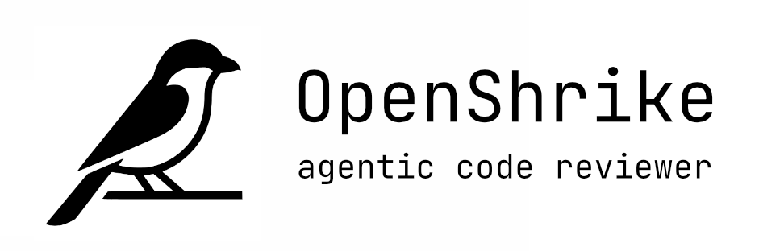
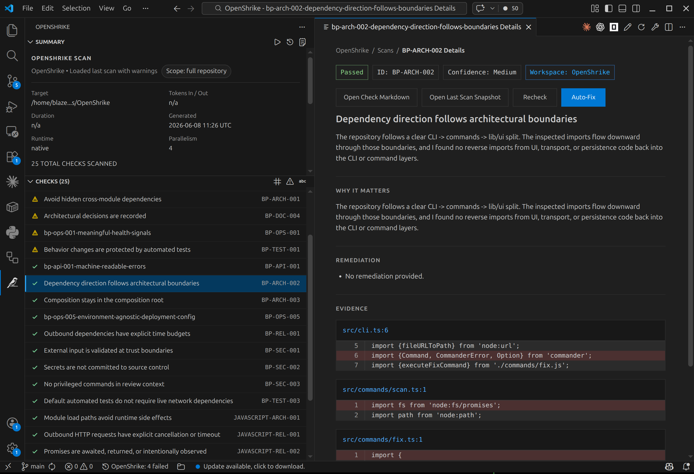
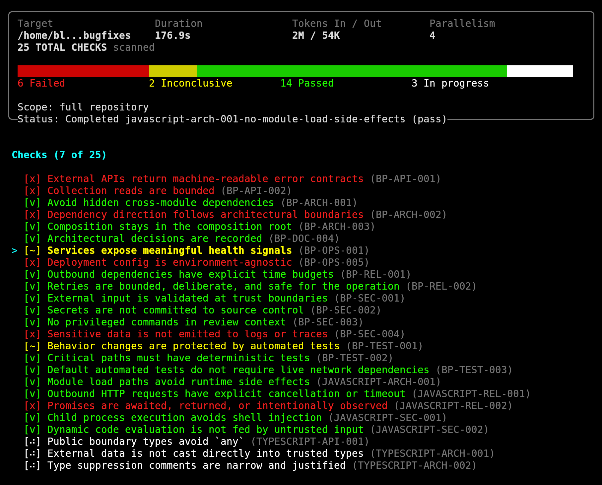

<div align="center">
  <a href="https://network-perspective.github.io/OpenShrike/"></a>
  <a href="https://marketplace.visualstudio.com/items?itemName=NetworkPerspective.openshrike"></a>
  <a href="https://www.npmjs.com/package/@networkperspective/openshrike"></a>
  <a href="https://discord.gg/4MKThAVsy2"></a><br/>
  <a href="https://github.com/Network-Perspective/OpenShrike/releases/latest"></a>
  <a href="https://github.com/Network-Perspective/OpenShrike/actions/workflows/release-bundles.yml"></a>
  <a href="https://github.com/Network-Perspective/OpenShrike/blob/main/LICENSE"></a>
  <br/>
  <!-- Keep these links. Translations will automatically update with the README. -->
  <a href="https://www.readme-i18n.com/Network-Perspective/OpenShrike?lang=de">Deutsch</a> | 
  <a href="https://www.readme-i18n.com/Network-Perspective/OpenShrike?lang=es">Español</a> | 
  <a href="https://www.readme-i18n.com/Network-Perspective/OpenShrike?lang=fr">français</a> | 
  <a href="https://www.readme-i18n.com/Network-Perspective/OpenShrike?lang=ja">日本語</a> | 
  <a href="https://www.readme-i18n.com/Network-Perspective/OpenShrike?lang=ko">한국어</a> | 
  <a href="https://www.readme-i18n.com/Network-Perspective/OpenShrike?lang=pt">Português</a> | 
  <a href="https://www.readme-i18n.com/Network-Perspective/OpenShrike?lang=zh">中文</a>
</div>

## Turn engineering best practices into automated, predictable code reviews

Code generation is fast. Code review is the new bottleneck. LLMs produce pull
requests in minutes; reviewing them thoroughly still takes hours. Teams either
drown in review or switch to YOLO mode — and existing tooling does not close
the gap. Linters catch syntax. Unit tests check behavior. OpenShrike's goal is
to systematically verify that a change follows the architectural decisions,
security practices, and engineering standards set by your team.

OpenShrike is a security-first, self-hosted code review tool that fills that
gap. Your standards live in the repo as versioned Markdown checks and policies
in [best_practices/](best_practices/). `shrike init` seeds the selected
policies into repo-local Markdown under `.openshrike/checks/`, so the checks
that actually run can be reviewed in code review and edited or extended by
maintainers. OpenShrike then executes those project-local checks with
[OpenCode](https://github.com/sst/opencode) and produces findings with
evidence, rationale, and remediation — locally or in CI, against the LLM
provider of your choice.

> **How it works:** OpenShrike is the policy layer, not the model runtime. It
> orchestrates [OpenCode](https://github.com/sst/opencode) to run your
> repo-local checks against a diff, then normalizes the results into a
> structured report. You bring the model (see [Security & privacy](#security--privacy)).

### VS Code extension — [install from marketplace](https://marketplace.visualstudio.com/items?itemName=NetworkPerspective.openshrike)


### Terminal app — install instructions below


## Why OpenShrike

- **Predictable checks.** You know exactly what is verified on every PR, not
  whatever a free-form `/review` prompt decided to look at this time.
- **Requirements as Markdown.** Standards live in the repo, versioned and
  reviewable — no proprietary DSL, no external dashboard.
- **Beyond linters and tests.** Enforce architectural boundaries, test
  discipline, boundary validation, secret hygiene, timeouts and cancellation,
  observability, and API safety.
- **Auto-fix with agents.** `shrike fix` spawns an agent to repair failing
  checks before a PR reaches a human reviewer.
- **BYOK.** Bring your own key and model — OpenAI, Anthropic, Bedrock, Azure,
  Ollama, LMStudio, and anything else OpenCode supports.
- **Self-hosted.** Runs locally or in CI with `native` and `docker` runtimes.
  With a local model, nothing leaves your machine; with a hosted provider, only
  the diff and check definitions you choose to send go to that provider, under
  your own key. See [Security & privacy](#security--privacy).

## Install

Prerequisite: [Node.js 22+](https://nodejs.org/en/download).

Install the CLI from npm:

```bash
npm install -g @networkperspective/openshrike
```

Install the VS Code extension:

```bash
code --install-extension networkperspective.openshrike
```

Or install the latest GitHub release bundle:

```bash
curl -fsSL https://raw.githubusercontent.com/Network-Perspective/OpenShrike/main/install | bash
```

On Windows PowerShell:

```powershell
irm https://raw.githubusercontent.com/Network-Perspective/OpenShrike/main/install.ps1 | iex
```

> Piping an install script to your shell runs remote code. If that is not
> acceptable in your environment, prefer the npm install above, or
> [build from source](#building-from-source) after reviewing the tree.

## Simple workflow

Assume `shrike` is on your `PATH`. If you are running directly from this
repository, use `./shrike` instead.

```bash
shrike init
shrike scan
```

- `shrike init` is interactive. It detects the project, helps establish
  AI provider access, lets you choose defaults, and writes
  `.openshrike/project.json`, `.openshrike/opencode.json`, and seeds
  `.openshrike/checks/`.
- `shrike scan` uses those saved defaults automatically and reads the
  Markdown checks from `.openshrike/checks/`. By default it scans
  uncommitted changes in the current repository. If there are no uncommitted
  changes, plain `shrike scan` asks whether it should run a full-repository
  scan instead.
- Re-run `shrike init` when you want to seed checks from different policies
  or change saved model, runtime mode, or parallelism defaults.

## What gets tested

OpenShrike policies are bundles of checks for things like:

- architecture and dependency boundaries,
- behavior-covering and deterministic tests,
- boundary validation and secret hygiene,
- time budgets, retries, and cancellation,
- deployability, health signals, and observability,
- API and data-shaping safety.

The bundled library is documented in
[best_practices/README.md](best_practices/README.md). The goal is not to
duplicate linters. The goal is to enforce the practices that actually keep
systems safe, maintainable, observable, and reliable.

## Example policy: baseline shared foundation

Policies are just bundles of checks. The
[baseline shared foundation](best_practices/policies/baseline-shared-foundation.md)
is the cross-language starter that `shrike init` seeds by default — 19
high-signal, language-agnostic checks that give a new repo meaningful coverage
without adopting the whole library at once:

**Security**
- [`sec-006`](best_practices/checks/shared/sec/sec-006-boundary-auth-and-principal-scoping.md) — Protected operations enforce authentication, authorization, and principal scoping at the boundary.
- [`bp-sec-001`](best_practices/checks/shared/sec/bp-sec-001-boundary-input-validation.md) — External input is validated at trust boundaries.
- [`bp-sec-004`](best_practices/checks/shared/sec/bp-sec-004-sensitive-data-not-emitted-to-logs-or-traces.md) — Sensitive data is not emitted to logs or traces.
- [`sec-008`](best_practices/checks/shared/sec/sec-008-public-responses-do-not-leak-secrets-or-internals.md) — Client-facing errors, URLs, and public responses do not leak secrets or internals.

**Reliability**
- [`bp-rel-001`](best_practices/checks/shared/rel/bp-rel-001-outbound-dependencies-have-explicit-time-budgets.md) — Outbound dependencies have explicit time budgets.
- [`bp-rel-002`](best_practices/checks/shared/rel/bp-rel-002-retries-are-bounded-deliberate-and-safe.md) — Retries are bounded, deliberate, and safe for the operation.
- [`rel-006`](best_practices/checks/shared/rel/rel-006-retried-or-redelivered-work-is-idempotent-or-deduplicated.md) — Retried or redelivered work is idempotent or deduplicated.
- [`rel-017`](best_practices/checks/shared/rel/rel-017-side-effects-run-after-durable-commit.md) — Side effects and downstream jobs run only after durable commit.
- [`rel-008`](best_practices/checks/shared/rel/rel-008-overload-work-and-resource-consumption-are-bounded.md) — Overload-triggering work and resource consumption are bounded.

**Architecture**
- [`bp-arch-001`](best_practices/checks/shared/arch-core/bp-arch-001-modules-depend-through-explicit-reviewable-seams.md) — Modules depend through explicit, reviewable seams.
- [`bp-arch-002`](best_practices/checks/shared/arch-core/bp-arch-002-dependency-direction-follows-the-architecture-instead-of-bypassing-it.md) — Dependency direction follows the architecture instead of bypassing it.

**API**
- [`api-004`](best_practices/checks/shared/api/api-004-retried-mutating-operations-idempotent-end-to-end.md) — Retried mutating operations are idempotent end-to-end.
- [`api-009`](best_practices/checks/shared/api/api-009-published-api-contracts-backward-compatible.md) — Published API contracts remain backward compatible within a version.
- [`bp-api-001`](best_practices/checks/shared/api/bp-api-001-machine-readable-error-contracts.md) — External APIs return machine-readable error contracts.

**Data**
- [`data-011`](best_practices/checks/shared/data/data-011-durable-state-mutations-are-atomic-rollback-safe-and-concurrency-correct.md) — Durable-state mutations are atomic, rollback-safe, and concurrency-correct.

**Operations**
- [`ops-022`](best_practices/checks/shared/ops/ops-022-configuration-is-semantically-validated-before-apply.md) — Configuration is semantically validated before it is applied.
- [`bp-ops-001`](best_practices/checks/shared/ops/bp-ops-001-meaningful-health-signals.md) — Services expose meaningful health signals.
- [`ops-017`](best_practices/checks/shared/ops/ops-017-per-unit-production-telemetry-is-structured-and-complete.md) — Per-unit production telemetry is structured and complete.
- [`ops-018`](best_practices/checks/shared/ops/ops-018-cross-boundary-work-preserves-correlation-and-dependency-attribution.md) — Cross-boundary work preserves correlation and dependency attribution.

This is one policy of many. Browse the full set of checks and policies —
language baselines included — in the
**[best practices library](https://openshrike.networkperspective.ai/library/)**.

### What a finding looks like

Every executed check emits a structured result. A failing check reads roughly
like this (illustrative):

```text
SEC-INPUT-VALIDATION  v3   status: fail   confidence: HIGH

evidence:     src/api/orders.ts:42 — request body passed to the handler
              without validation before reaching the persistence layer.
rationale:    External input crosses a trust boundary unvalidated, which is a
              direct injection and data-integrity risk.
remediation:  Validate and type the request body at the boundary (e.g. a schema
              parser) before it is used downstream.
```

Checks resolve to `pass`, `fail`, or `unknown`. `unknown` is used when a rule
does not apply to the diff or the evidence is too weak to justify a `fail` —
OpenShrike biases toward `unknown` over false positives.

## Command reference

Each command has a `--help` flag with the full option list. The examples below
cover the common cases.

### `shrike init`

Interactively initialize Shrike defaults in the local `.openshrike` directory.

```bash
shrike init           # first-time setup
shrike init --force   # re-seed and overwrite existing files
shrike init --help    # full reference
```

### `shrike scan`

Run a check or policy bundle against a repository. After `shrike init`, a plain
`shrike scan` uses saved defaults from `.openshrike/project.json` and executes
the Markdown checks in `.openshrike/checks/`.

```bash
shrike scan                          # use saved defaults on uncommitted changes
shrike scan --scope branch \
  --target main                      # scan the current branch vs. main
shrike scan --scope pr \
  --target develop...HEAD            # PR-style diff scan
shrike scan --scope full             # scan the whole repository
shrike scan --policy baseline-lang-csharp # run a specific policy
shrike scan --runtime docker         # run in an ephemeral container
shrike scan --help                   # full reference
```

### `shrike fix`

Fix failing checks one by one and recheck them. Useful for closing out the long
tail of mechanical violations before a human review.

```bash
shrike fix                # fix using saved defaults
shrike fix --last-scan    # reuse .openshrike/last-scan.json instead of rescanning
shrike fix --scope branch \
  --target main           # fix changes on the current branch vs. main
shrike fix --help         # full reference
```

## Output and exit codes

- `--output markdown` is the default and emits human-readable reports and error messages.
- `--output json` emits machine-readable reports and error envelopes.
- Exit code `0`: no failing checks.
- Exit code `1`: command or runtime error.
- Exit code `2`: one or more failing checks.

## Security & privacy

OpenShrike is self-hosted and stores its configuration and checks in your repo
under `.openshrike/`. Two facts are worth being explicit about:

- **Your model provider sees what you send it.** OpenShrike is BYOK. When you
  configure a hosted provider (OpenAI, Anthropic, Bedrock, Azure, …), the diff
  under review and the relevant check definitions are sent to that provider's
  API under your own key, subject to that provider's data policy. For fully
  local review where nothing leaves the machine, configure a local model such
  as Ollama or LMStudio.
- **The `docker` runtime isolates execution, not network egress.** It runs
  checks in an ephemeral container; it does not by itself prevent the model
  call from reaching a hosted provider.

To report a security issue, please see [SECURITY.md](SECURITY.md). <!-- TODO: add SECURITY.md with a contact/process -->

## Building from source

Prerequisite: [Node.js 22+](https://nodejs.org/en/download).

```bash
npm install
npm run build
scripts/install-local.sh --source ./shrike --link
```

If `~/.local/bin` is not on your `PATH`, add it in your shell profile.
`shrike init` expects an interactive terminal.

### Development

```bash
npm run dev -- scan --policy baseline-lang-csharp --path .
npm run build
npm run typecheck
npm test
```

The `./shrike` launcher uses `tsx src/cli.ts` when available and falls back to
`dist/cli.js`.

### Publishing a bundle

Create a local framework bundle:

```bash
scripts/publish.sh
```

Install from the published framework bundle:

```bash
scripts/install-local.sh --source .artifacts/publish/framework
```

## Contributing

Issues and pull requests are welcome. If you are adding or changing checks, see
the authoring rules in [best_practices/README.md](best_practices/README.md).

## License

Released under the [MIT License](LICENSE).
